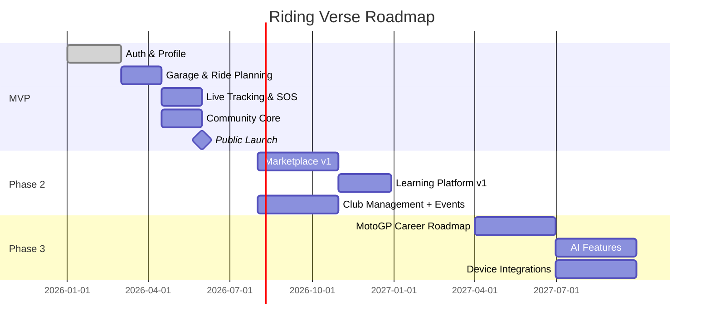

# 05 — Product Roadmap

Legend: **MVP** (Months 0–6) · **Phase 2** (Months 7–14) · **Phase 3** (Months 15–24) · **Future Vision** (24+ months)

## MVP (Months 0–6) — "Foundation: Safety + Ride + Community Core"
- Authentication (Phone OTP, Google, Apple, Email, device sessions)
- Profile & Garage (motorcycle profile, basic maintenance reminders)
- Ride Planning (manual route creation, GPX import/export, fuel stop suggestions)
- Live Ride Tracking (start/stop, GPS recording, live share link)
- Basic Safety (SOS button, emergency contacts, basic crash-detection heuristic)
- Community Core (feed, posts, likes, comments, groups/clubs — basic)
- Events (create/discover, RSVP; no ticketing yet)
- Notifications (push, SMS for critical safety alerts)
- Subscriptions v1 (Free vs Premium, Razorpay integration)
- Admin Panel v1 (user/content moderation, basic analytics)

## Phase 2 (Months 7–14) — "Community Depth + Marketplace + Learning"
- Stories & Reels
- Club Management (roles, membership tiers, dues)
- Event Ticketing & Payments
- Marketplace v1 (accessories, used bikes, services/mechanics directory)
- Fuel Stations, EV Charging, Hotels/Camping directory
- Advanced crash detection (ML-based, multi-sensor fusion)
- Geofencing, ETA sharing, weather/speed alerts
- Gamification (challenges, badges, leaderboards)
- Learning Platform v1 (Beginner/Intermediate courses, quizzes, certificates)
- Wallet & in-app payments unification
- Dealer/Brand Portal v1
- Localization (5 Indian languages)

## Phase 3 (Months 15–24) — "Motorsport Pathway + AI + Scale"
- MotoGP Career Roadmap (full age/country-wise pathway, academy directory, cost estimator)
- Race Results & Training Institute integrations
- AI Ride Summaries, AI Trip Planner, AI Mechanical Assistant, AI Road Safety Tips
- OBD Integration (read-only diagnostics)
- Helmet/Intercom/GoPro/Garmin device integrations (companion data import)
- Creator Economy tools (Creator Profiles, Earnings, Affiliate Links)
- Advanced analytics & BI for admin/business
- Insurance Claims facilitation
- Marketplace v2 (escrow payments, seller verification tiers)
- International pilot market (e.g., Nepal/Sri Lanka or SE Asia)

## Future Vision (24+ months)
- AI Ride Coach & Predictive Maintenance
- Smart Helmet HUD / AR Navigation integrations
- Dashcam AI & Road Hazard AI (auto-tagging from video)
- Drone companion ride recording (experimental)
- Voice Assistant (in-ride, hands-free)
- Motorcycle Visa Assistance & International Travel Packages
- Bike-sharing / rental marketplace
- White-label platform licensing for OEMs
- Autonomous rider-assist safety systems (ADAS-style alerts via phone sensors + connected bike data)
- Web3/NFT — discussion-only, not committed (see `18-future-features.md`)

## Roadmap Timeline (Mermaid)

## Release Cadence
- 2-week sprint cycles, monthly production releases for MVP/Phase 2.
- Feature flags (see `17-security.md` / infra) allow staged rollout and city-by-city gating.
- Full release governance in `22-release-plan.md`.
