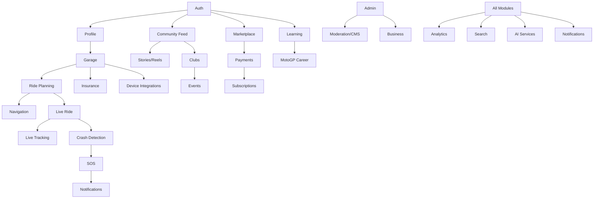

# 07 — Modules Architecture

Each module maps to a backend NestJS module, owns specific database tables, and exposes REST/GraphQL endpoints (see `12-api-modules.md`).

## Module Map

| # | Module | Owns Tables (examples) | Primary Screens | Depends On |
|---|---|---|---|---|
| 1 | Auth | users, sessions, refresh_tokens, devices, otp_requests | Splash, Login, OTP, Register | — |
| 2 | Profile | users, user_interests, user_languages | Profile, Edit Profile, Public Profile | Auth |
| 3 | Garage | motorcycles, manufacturers, models, variants, garage_documents | Garage, Add Bike, Bike Detail | Auth, Profile |
| 4 | Maintenance | maintenance_records, service_reminders, expenses, fuel_logs | Maintenance, Service History, Expenses | Garage |
| 5 | Ride Planning | routes, waypoints, gpx_files, scenic_routes | Route Planner, Route Detail | Garage, Maps |
| 6 | Navigation | routes, road_hazards, offline_map_regions | Navigation, Offline Maps | Ride Planning, Maps |
| 7 | Live Ride | rides, ride_participants, gps_points | Ride Recording, Ride Summary | Ride Planning |
| 8 | Live Tracking | live_sessions, location_shares | Live Tracking View, Share Link | Live Ride |
| 9 | Crash Detection | crash_events, crash_signals | Crash Alert, Crash Confirmation | Live Ride, Notifications |
| 10 | SOS & Safety | sos_logs, emergency_contacts, geofences | SOS Screen, Emergency Contacts | Auth, Notifications |
| 11 | Roadside Assistance | assistance_requests, assistance_partners | Roadside Request, Partner List | SOS |
| 12 | Community Feed | posts, comments, likes, bookmarks, hashtags | Feed, Post Detail, Create Post | Auth, Profile |
| 13 | Stories/Reels | stories, reels, story_views | Stories Viewer, Reels Feed | Community Feed |
| 14 | Groups/Clubs | groups, clubs, club_members, club_roles | Club Home, Club Members | Community Feed |
| 15 | Events | events, event_rsvps, event_tickets | Event Detail, Create Event | Clubs |
| 16 | Messaging | conversations, messages, message_media | Chat List, Chat Room | Auth, Profile |
| 17 | Marketplace | listings, orders, reviews, wishlists | Marketplace Home, Listing Detail | Auth, Payments |
| 18 | Directory (Fuel/EV/Hotel/Camping) | fuel_stations, ev_stations, hotels, campsites | Directory Screens | Maps |
| 19 | Gamification | challenges, achievements, badges, leaderboards | Challenges, Leaderboard | Live Ride |
| 20 | Payments/Wallet | transactions, wallets, payment_methods | Wallet, Checkout | Auth |
| 21 | Subscriptions | subscriptions, plans, coupons | Subscription Plans, Billing | Payments |
| 22 | Learning | courses, lessons, quizzes, certificates | Course Catalog, Lesson Player | Auth |
| 23 | MotoGP Career | career_roadmap, academies, race_results, mentors | Career Roadmap, Academy Directory | Learning |
| 24 | Insurance/Claims | insurance_policies, claims | Insurance Hub, Claim Filing | Garage |
| 25 | Device Integrations | connected_devices, obd_readings | Device Pairing, Device Data | Garage |
| 26 | Admin/CMS/Moderation | admin_users, moderation_reports, cms_content | Admin Dashboard | All |
| 27 | Business (Dealer/Brand) | businesses, brand_pages, ad_campaigns | Business Portal | Admin |
| 28 | Analytics | analytics_events, aggregated_stats | Analytics Dashboard | All |
| 29 | Search | search_index_meta | Global Search | ElasticSearch/Meilisearch |
| 30 | AI Services | ai_requests, ai_ride_summaries | AI Assistant | Live Ride, Garage |
| 31 | Notifications | notifications, notification_preferences | Notification Center | All |
| 32 | Localization | translations, locales | Settings > Language | All |
| 33 | Developer/API Platform | api_keys, webhooks | Developer Portal (web) | Admin |

## Module Interaction (Mermaid)

## Backend Service Boundaries (Modular Monolith → Future Microservices)
MVP ships as a **modular monolith** in NestJS (single deployable, clearly bounded modules) to reduce operational overhead. Natural microservice extraction points as scale grows:
1. **Live Tracking / Location Service** — highest throughput (GPS point ingestion), first candidate for extraction, backed by its own Redis pub/sub + Socket.IO cluster.
2. **Notification Service** — fan-out heavy, queue-driven (BullMQ/RabbitMQ), independently scalable.
3. **Search Service** — Meilisearch/ElasticSearch indexing pipeline, event-driven from core DB changes.
4. **AI Service** — isolated for cost/latency control and provider abstraction (OpenAI/Gemini/Claude).
5. **Payments/Wallet Service** — isolated for PCI-adjacent compliance boundary.

## Cross-Cutting Concerns (apply to every module)
- Authentication guard (JWT) on all protected routes.
- RBAC (role-based access control) for admin/business/moderator roles.
- Audit logging (who did what, when) on all mutating operations.
- Soft delete (`deleted_at`) on all user-generated content tables.
- Rate limiting per user/IP (Redis-backed) on write-heavy endpoints (posts, messages, SOS).
- Idempotency keys on payment and SOS-triggering endpoints.
