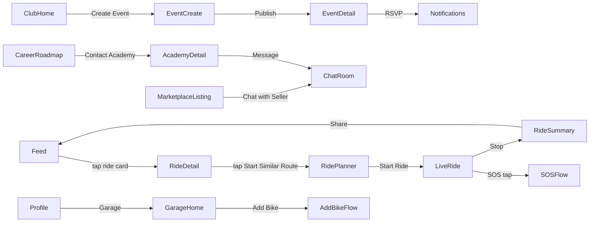

# 09 — Navigation Architecture

## 1. Framework

Expo Router (file-based routing) with a typed route structure. Root layout uses a stack + bottom tab navigator hybrid.

## 2. Top-Level Navigation Structure

```
app/
  (auth)/
    splash.tsx
    onboarding/[step].tsx
    login.tsx
    otp.tsx
    register.tsx
  (tabs)/
    index.tsx              -> Home/Feed
    rides.tsx               -> Ride Planning/History
    live.tsx                -> Live Ride (center, prominent tab)
    community.tsx           -> Clubs/Events/Groups
    marketplace.tsx         -> Marketplace
    profile.tsx             -> Profile
  ride/
    plan/[step].tsx
    live/[rideId].tsx
    [rideId]/index.tsx
    [rideId]/replay.tsx
  safety/
    sos.tsx
    crash-detected.tsx
    roadside-assistance.tsx
  clubs/
    [clubId]/index.tsx
    [clubId]/members.tsx
    discover.tsx
  events/
    [eventId]/index.tsx
    create.tsx
  marketplace/
    listing/[id].tsx
    create-listing/[step].tsx
  learning/
    course/[id]/lesson/[lessonId].tsx
  career/
    roadmap.tsx
    academies/[id].tsx
  chat/
    [conversationId].tsx
  settings/
    index.tsx
    privacy.tsx
    language.tsx
  admin/ (web only, separate app shell)
```

## 3. Bottom Tab Bar (Primary Navigation)

1. **Home/Feed** — community feed
2. **Rides** — planning, history, saved routes
3. **Live Ride (center, elevated FAB-style tab)** — one-tap start ride / SOS quick access
4. **Community** — clubs, events, groups, messaging entry
5. **Profile** — profile, garage, settings entry

## 4. Navigation Rules

- **Deep linking:** every shareable entity (ride, post, club, event, listing, profile) has a stable deep link `ridingverse://<module>/<id>` and universal link `https://app.ridingverse.com/<module>/<id>`.
- **Auth gating:** routes under `(tabs)`, `ride/`, `safety/`, `clubs/`, `marketplace/`, `chat/` require valid session; unauthenticated deep links redirect through login with a return-to redirect param.
- **Modal vs Stack:** SOS, crash-detected, and checkout flows render as full-screen modals to prevent accidental back-navigation during critical flows.
- **Back-button behavior:** Android hardware back is intercepted on Live Ride Recording screen — requires explicit "Stop Ride" confirmation rather than default back-navigation.
- **Tab persistence:** each tab maintains its own navigation stack (nested stack per tab) so switching tabs and returning preserves scroll/state.

## 5. Cross-Module Navigation Flows (Mermaid)



## 6. Route Guards & Permissions Matrix

| Route Group                  | Auth Required | Role Required           | Notes                                         |
| ---------------------------- | ------------- | ----------------------- | --------------------------------------------- |
| `(auth)/*`                   | No            | —                       | Redirects to `(tabs)` if already logged in    |
| `(tabs)/*`                   | Yes           | —                       | Core app                                      |
| `safety/*`                   | Yes           | —                       | Requires emergency contact configured for SOS |
| `clubs/[id]/settings`        | Yes           | Club Admin/Moderator    | RBAC checked server-side                      |
| `admin/*`                    | Yes           | Admin/Moderator/Support | Separate web app, RBAC enforced               |
| `marketplace/create-listing` | Yes           | Verified phone          | Fraud prevention gate                         |

## 7. State Restoration

- Zustand + MMKV persist last active tab, in-progress ride draft, and unsent chat drafts across app restarts.
- Live Ride screen restores an in-progress ride session automatically if the app was killed mid-ride (recovery banner: "Resume ride in progress?").
