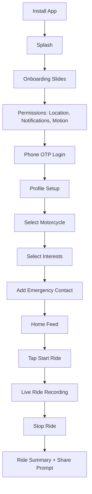
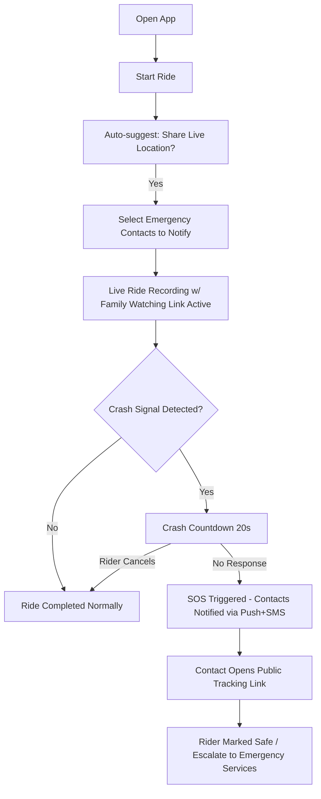
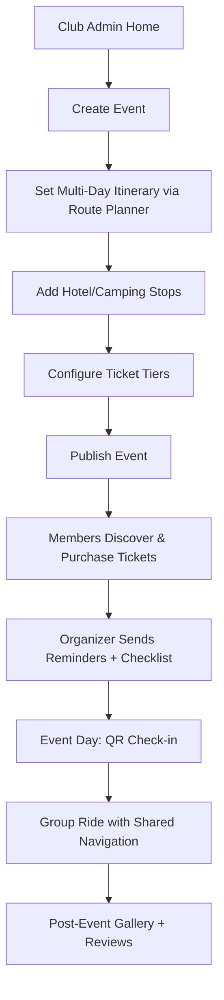
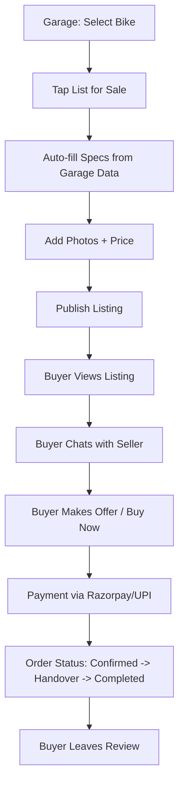
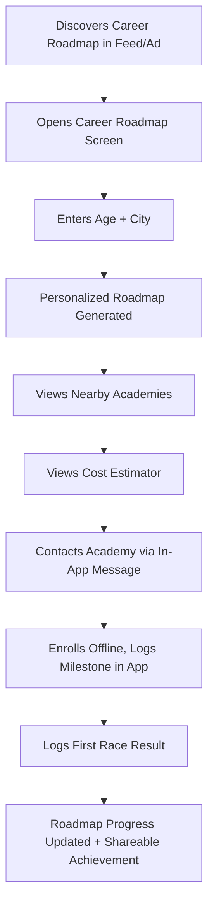
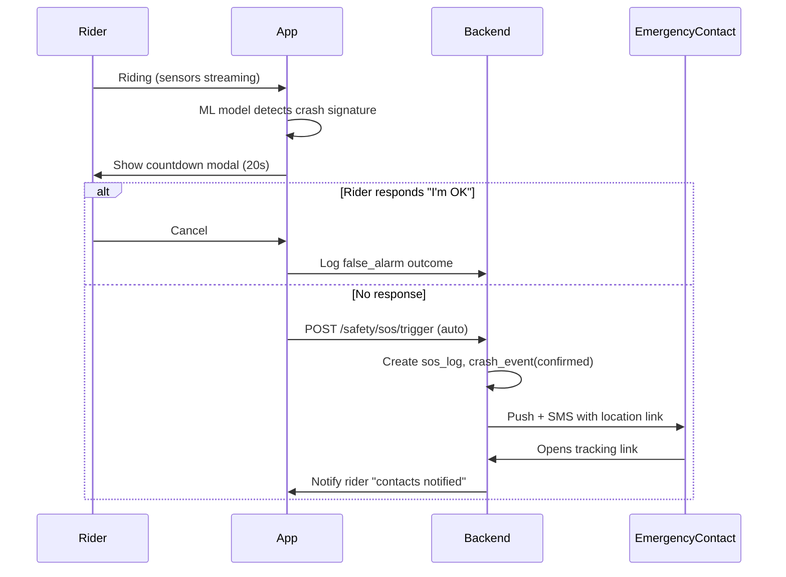
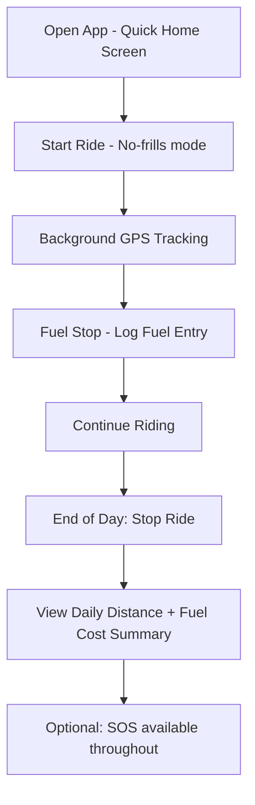
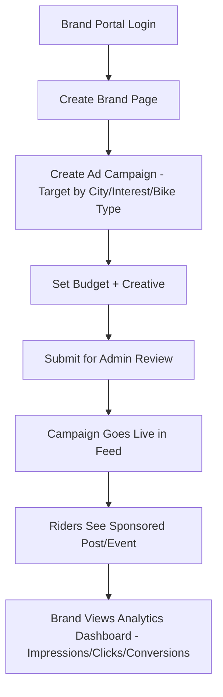

# 13 — User Journeys

## 1. First-Time User Onboarding → First Tracked Ride

**Key success moment:** completing first tracked ride with an emergency contact configured — the core "safety trust" moment.

## 2. Solo Female Rider — Safety-First Ride

## 3. Club Organizer — Planning a Paid Multi-Day Tour

## 4. Marketplace — Selling a Used Motorcycle

## 5. MotoGP Aspirant — Discovering the Career Pathway

## 6. Crash Detection → Emergency Response (Critical Path)

## 7. Delivery Rider — Daily Utility Flow

## 8. Brand — Running a Sponsored Campaign

