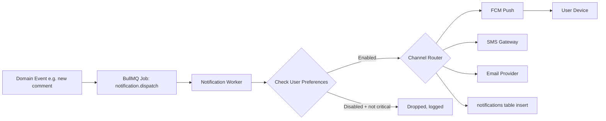

# 14 — Notifications

## 1. Channels
| Channel | Provider | Use Cases |
|---|---|---|
| Push | Firebase Cloud Messaging (Expo Notifications wrapper) | Most notifications: social, ride, safety |
| SMS | MSG91 / Twilio | OTP, SOS fallback, critical safety alerts |
| Email | SES / SendGrid | Receipts, weekly digest, account/security alerts |
| WhatsApp (Future) | WhatsApp Business API | Event reminders, marketplace order updates (Phase 3+) |
| In-App | Notification Center | All of the above, persisted |

## 2. Notification Categories & Priority

| Category | Example | Priority | Channels | User-Configurable |
|---|---|---|---|---|
| Safety-Critical | SOS triggered, crash detected | Critical | Push + SMS (always, non-optional) | No |
| Account/Security | New device login, password change | High | Push + Email | Partially |
| Ride | Ride invite, group ride starting, ride completed by friend | Medium | Push | Yes |
| Social | Like, comment, follow, mention | Low-Medium | Push | Yes |
| Club/Event | Event reminder, RSVP update, club announcement | Medium | Push + Email (event reminders) | Yes |
| Marketplace | New message, order status update | Medium-High | Push | Partially |
| Learning/Career | Course reminder, milestone unlocked | Low | Push | Yes |
| Marketing | Promotions, feature announcements | Low | Push (opt-in) + Email | Yes |
| System | App update available, maintenance window | Low | Push + In-app banner | No |

## 3. Delivery Architecture

- Safety-critical notifications bypass the preference check and use a **dedicated high-priority BullMQ queue** with separate worker pool and automatic retry-with-fallback (push fails → auto-fallback to SMS within 10s).
- Fan-out notifications (e.g., club announcement to 5,000 members) are batched and rate-limited to avoid FCM throttling; processed via RabbitMQ for very large fan-outs.

## 4. Notification Preferences (User-Facing Settings)
- Master toggles per category (Ride, Social, Club/Event, Marketplace, Learning, Marketing).
- Per-channel toggle within each category (Push/Email; SMS reserved for safety-critical + OTP only).
- Quiet hours setting (e.g., mute non-critical 10 PM–7 AM) — safety-critical always bypasses quiet hours.

## 5. Deep Link Payload Structure
```json
{
  "type": "ride_invite",
  "title": "Rahul invited you to a ride",
  "body": "Sunday Coastal Ride at 6:00 AM",
  "data": {
    "deepLink": "ridingverse://rides/invite/abc123",
    "rideId": "abc123",
    "screen": "SCR-074"
  }
}
```

## 6. Notification Center (In-App)
- Screen: `/notifications` (see `08-screen-flow.md`) — grouped by Today/This Week/Earlier, unread indicator, tap-to-mark-read, swipe-to-dismiss.
- Badge count on Profile tab reflecting unread count (debounced, updated via Socket.IO for real-time badge updates).

## 7. Analytics on Notifications
- Track `notification_sent`, `notification_delivered`, `notification_opened`, `notification_dismissed` per category/channel to measure engagement and tune send frequency (avoid notification fatigue — cap non-critical pushes at ~5/day per user by default, configurable via feature flag).

## 8. Compliance
- SMS/WhatsApp marketing messages require explicit opt-in per TRAI (India) regulations.
- All marketing communications include unsubscribe/opt-out mechanism.
- OTP and safety-critical SMS are exempt from marketing consent requirements but logged for audit.
